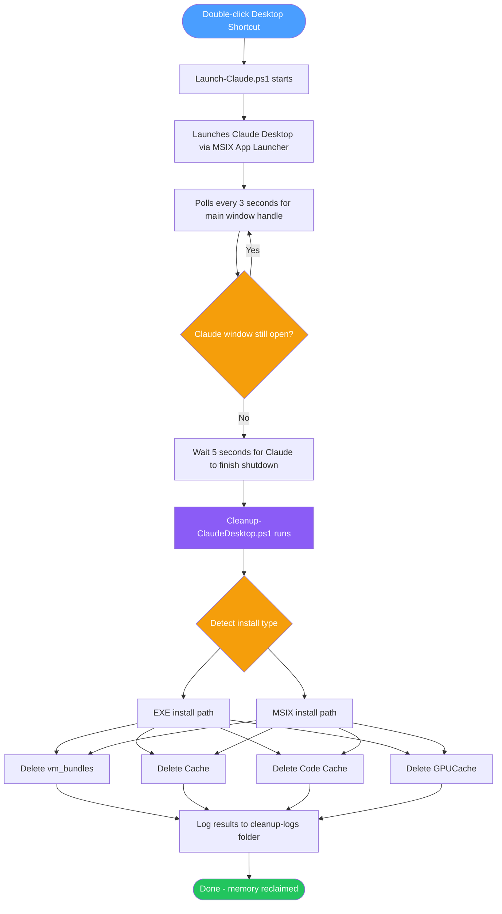

# claude-memory-plug

Claude Desktop on Windows silently accumulates gigabytes of VM bundles and cache files that persist even after the app is closed, steadily consuming memory and disk space on low-resource machines. This project solves that by wrapping Claude Desktop's launch in a PowerShell script that automatically detects when you close the app and immediately runs a safe cleanup — no manual steps, no scheduled tasks, no configuration required after setup. It preserves all your memory, credentials, skills, and session history while reclaiming the bloat.

---

## How It Works



---

## What Is Preserved

The cleanup script **never touches** the following:

| Item | Path | Why |
|---|---|---|
| App settings & MCP config | `%APPDATA%\Claude\claude_desktop_config.json` | Your MCP server connections |
| Memory, skills, history | `%USERPROFILE%\.claude\` | All session context and skills |
| Auth credentials | `%USERPROFILE%\.claude.json` | Login tokens |

---

## Script Descriptions

### `Cleanup-ClaudeDesktop.ps1`
The core cleanup engine. Detects whether you have an EXE or MSIX install of Claude Desktop, stops any running Claude processes and the CoworkVMService gracefully, then deletes the VM bundle, Electron cache, V8 code cache, and GPU cache. Logs every run with bytes freed to `%APPDATA%\Claude\cleanup-logs\` and keeps only the last 10 logs. Can be run manually at any time or called silently by the launcher.

### `Launch-Claude.ps1`
The wrapper that ties everything together. Launches Claude Desktop via the Windows MSIX app launcher, then polls every 3 seconds watching for the main window handle to drop to zero (indicating the app has truly closed, not just minimized to tray). Once detected, it waits 5 seconds for Claude to finish its own shutdown, then calls `Cleanup-ClaudeDesktop.ps1` automatically. This is what your desktop shortcut points to.

### `Create-ClaudeShortcut.ps1`
A one-time setup script that creates a desktop shortcut pointing to `Launch-Claude.ps1`. It automatically detects your Claude Desktop install location and uses the Claude app icon so the shortcut looks identical to the original. Handles both standard Desktop paths and OneDrive-managed Desktop folders.

---

## Setup Guide

### Prerequisites
- Windows 10 or 11
- Claude Desktop installed (EXE or Microsoft Store / MSIX version)
- PowerShell 5.1 or later (built into Windows)

---

### Step 1 — Download the Repository

**Option A: Download ZIP**
1. Go to [https://github.com/gcoleman0828/claude-memory-plug](https://github.com/gcoleman0828/claude-memory-plug)
2. Click the green **Code** button → **Download ZIP**
3. Extract the ZIP to `C:\Claude\claude-memory-files\`

**Option B: Clone with Git**
```powershell
git clone https://github.com/gcoleman0828/claude-memory-plug.git C:\Claude\claude-memory-files
```

---

### Step 2 — Unblock the Scripts

Windows blocks scripts downloaded from the internet by default. Open PowerShell and run:

```powershell
cd C:\Claude\claude-memory-files
Unblock-File .\Cleanup-ClaudeDesktop.ps1
Unblock-File .\Launch-Claude.ps1
Unblock-File .\Create-ClaudeShortcut.ps1
```

---

### Step 3 — Set Execution Policy (if needed)

If you have not run PowerShell scripts before on this machine:

```powershell
Set-ExecutionPolicy -Scope CurrentUser RemoteSigned
```

Type `Y` and press Enter when prompted.

---

### Step 4 — Test the Cleanup Script

Run the cleanup manually first to confirm it works on your machine:

```powershell
.\Cleanup-ClaudeDesktop.ps1
```

You should see it detect your install path, report reclaimable space, and confirm what was deleted. If it works here, the automation will work too.

---

### Step 5 — Create the Desktop Shortcut

```powershell
.\Create-ClaudeShortcut.ps1
```

This creates a **Claude Desktop** shortcut on your desktop. 

> **OneDrive users:** If your Desktop is managed by OneDrive and the shortcut does not appear, run this one-liner to place it in the correct location:
> ```powershell
> $WshShell = New-Object -ComObject WScript.Shell
> $Shortcut = $WshShell.CreateShortcut("$env:USERPROFILE\OneDrive\Desktop\Claude Desktop.lnk")
> $Shortcut.TargetPath = "powershell.exe"
> $Shortcut.Arguments = "-ExecutionPolicy Bypass -WindowStyle Minimized -File `"C:\Claude\claude-memory-files\Launch-Claude.ps1`""
> $Shortcut.WorkingDirectory = "C:\Claude\claude-memory-files"
> $Shortcut.IconLocation = "$env:LOCALAPPDATA\AnthropicClaude\Claude.exe,0"
> $Shortcut.Save()
> ```

---

### Step 6 — Replace Your Old Claude Shortcut

1. Find the original Claude shortcut on your desktop
2. Either delete it or rename it (e.g. `Claude Desktop - OLD`) to avoid confusion
3. Use the new **Claude Desktop** shortcut from now on

---

### Step 7 — Verify It Works

1. Open Claude Desktop using the new shortcut
2. A small PowerShell window will appear briefly confirming Claude has started — you can minimize it
3. Use Claude normally
4. Close Claude Desktop
5. Within a few seconds the PowerShell window will show cleanup output and then close itself

Check your cleanup logs anytime at:
```
%APPDATA%\Claude\cleanup-logs\
```

---

## Running the Cleanup Manually

You can run the cleanup script at any time independently:

```powershell
# Interactive — shows prompts and confirmation
.\Cleanup-ClaudeDesktop.ps1

# Silent — no prompts, just runs (same as when called automatically)
.\Cleanup-ClaudeDesktop.ps1 -Silent -Force
```

---

## Troubleshooting

| Problem | Fix |
|---|---|
| Shortcut not on desktop | Check `C:\Users\YourName\Desktop` and `C:\Users\YourName\OneDrive\Desktop` — use the OneDrive one-liner in Step 5 |
| Script blocked warning | Run `Unblock-File` on all three scripts as shown in Step 2 |
| Claude Code opens instead of Desktop app | The launcher uses the MSIX app ID — make sure you have Claude Desktop installed from the Anthropic website or Microsoft Store |
| Cleanup does not trigger after closing | Make sure you are fully closing Claude (not just minimizing to tray) — right-click the tray icon and choose Exit first |
| Nothing found to clean | Claude may not have been used long enough to accumulate cache — this is normal on a fresh install |

---

## Contributing

Pull requests welcome. If your install path differs or you find additional cache locations, please open an issue with the output of:

```powershell
Get-ChildItem "$env:APPDATA\Claude" | Select-Object Name, Length
Get-ChildItem "$env:LOCALAPPDATA\Packages" -Filter "Claude_*" | Select-Object Name
```